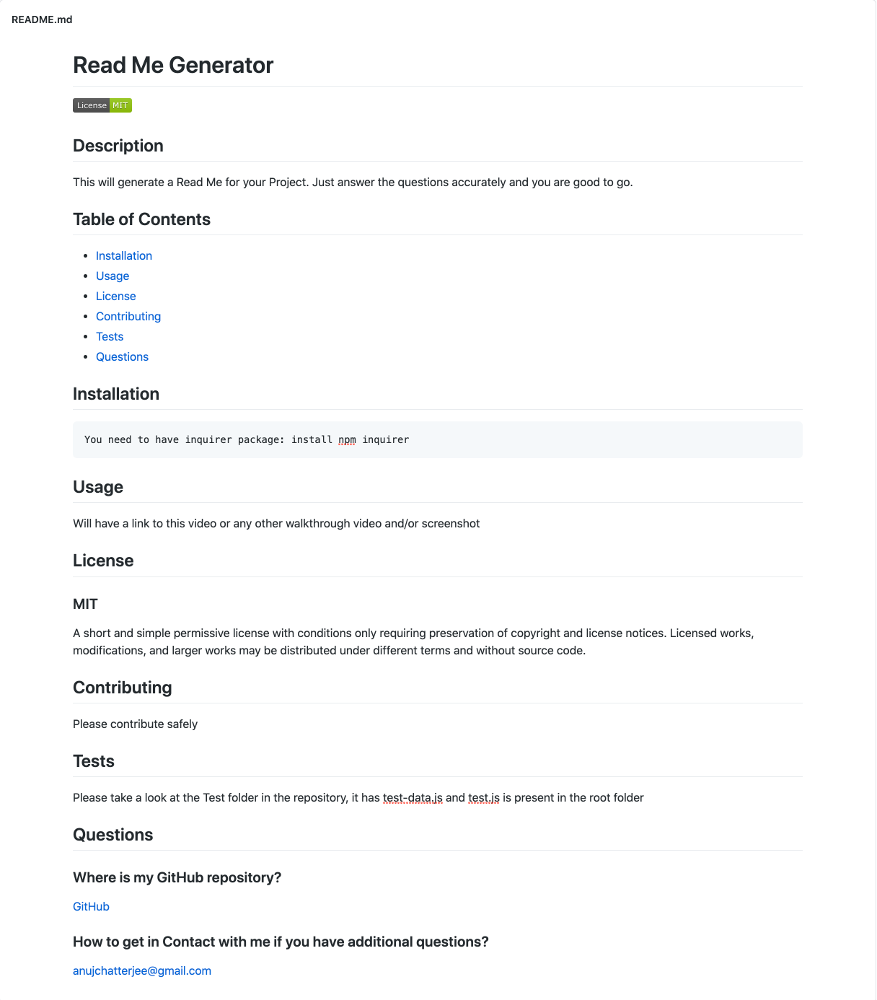

# Read Me Generator
(This readME was mostly generated using this generator)

## Description

This will generate a Read Me for your Project. Just answer the questions accurately and you are good to go.
    

## Table of Contents
* [Installation](#installation)
* [Usage](#usage)
* [License](#license)
* [Contributing](#contributing)
* [Tests](#tests)
* [Questions](#questions)

## Installation

    Go to the parent folder in terminal
    then just run 
    node app.js     

## Usage

### WalkThrough Video

<https://drive.google.com/file/d/1ux8LlpolLZ5L9LUfjdY7ZBVE0GE3n84R/view>

### Sample ReadME:
[Sample Read ME](./assets/sample_README.md)

### Screenshot

## License

### MIT
A short and simple permissive license with conditions only requiring preservation of copyright and license notices. Licensed works, modifications, and larger works may be distributed under different terms and without source code.
        

## Contributing

Please contribute safely
    

## Tests

Please take a look at the Test folder in the repository, it has test-data.js and test.js is present in the root folder. 
    

## Questions
### Where is my GitHub repository?
[GitHub](https://github.com/chattean)

### How to get in Contact with me if you have additional questions?

anujchatterjee@gmail.com
    

